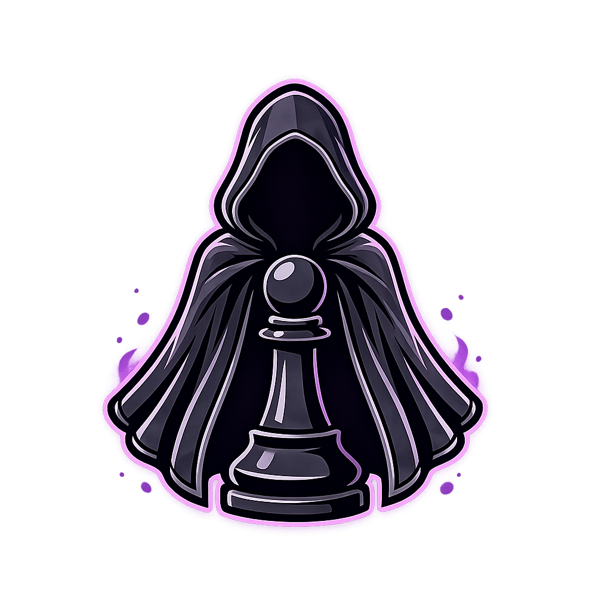

  

# Shadow

Shadow is a chess engine written in C++.

The goal of this project is to experiment with NNUE training, and have fun building a chess engine.

## Strength

| Version | Elo |
|----------|----------|
| Shadow 0.3 | 3400 |
| Shadow 0.2 | 3046 |
| Shadow 0.1 | 2591 |

*Estimated.

Tested at 10+0.1 time control.

## Thank You

Thanks to everyone who has shared advice and ideas along the way. 
Also thanks to the many chess engines and developers who inspired me.

[bullet](https://github.com/jw1912/bullet) for NNUE training.
