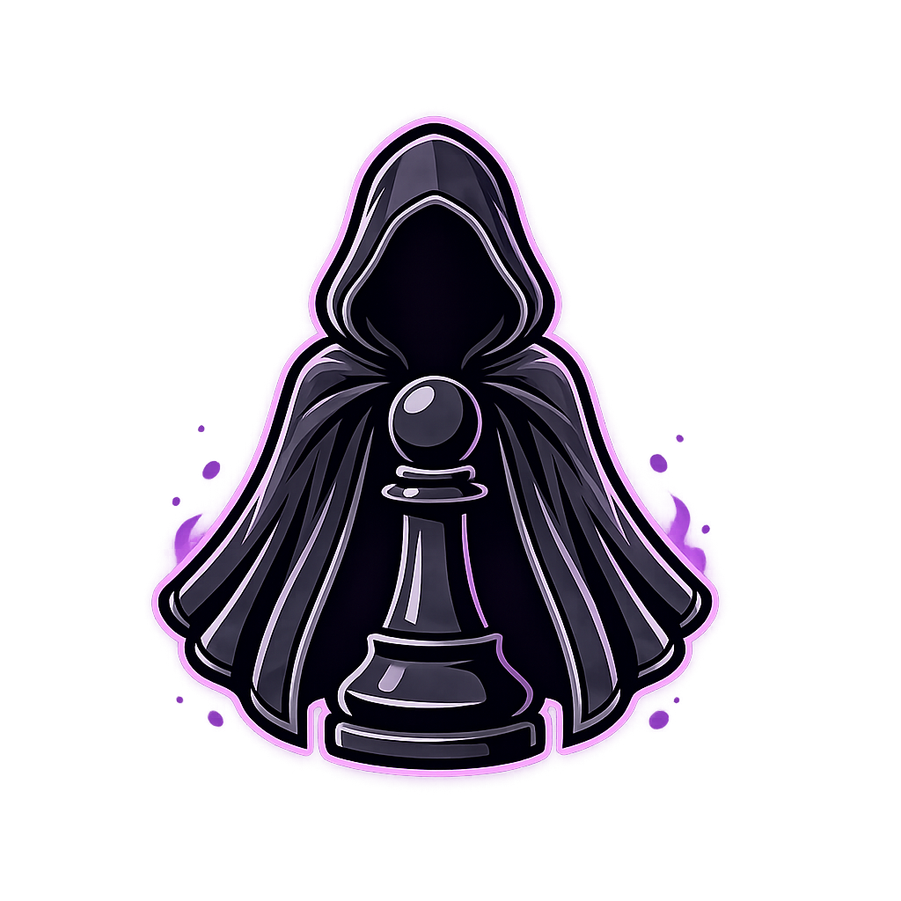

  

# Shadow

Shadow is a chess engine written in C++.

The goal of this project is to experiment with NNUE training, and have fun building a chess engine.

## Strength

| Version | Elo |
|----------|----------|
| Shadow 0.3 | 3370 |
| Shadow 0.2 | 3046 |
| Shadow 0.1 | 2591 |

*Estimated.

Tested at 10+0.1 time control.

## Credit

Thanks to everyone who has shared advice and ideas along the way.
Also, thanks to the many chess engine developers who inspired me.

Special thanks to:

- [bullet](https://github.com/jw1912/bullet) for NNUE training.
- The following engines for being a source of inspiration:
  - [Stockfish](https://github.com/official-stockfish/Stockfish)
  - [Obsidian](https://github.com/gab8192/Obsidian)
  - [Catalyst](https://github.com/AnanyTanwar/Catalyst)
  - [Raphael](https://github.com/Orbital-Web/Raphael)
